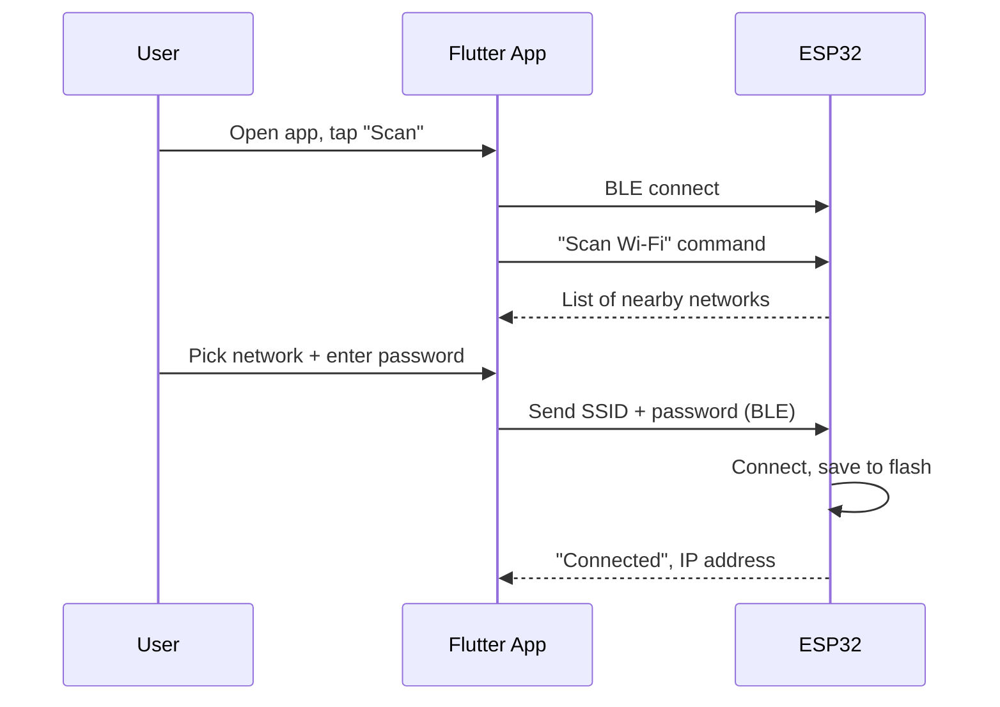

# esp-ble-wifi-provisioning

**Set up any ESP32 device's Wi-Fi from a phone app over Bluetooth — no
hardcoded credentials, no serial cable, no captive portal.**

Made by **[ZAN Tech](https://github.com/ZAN-Tech)** and released as a free,
open-source baseline. Use it as-is, rip out the parts you don't need, or
build an entire product on top of it — that's the point.

[](LICENSE)
[](firmware/)
[](app/)
[](https://github.com/ZAN-Tech-bd/esp-ble-wifi-provisioning/releases/latest)

📱 **Just want to try the app?** Grab the prebuilt APK from the
[**latest release**](https://github.com/ZAN-Tech-bd/esp-ble-wifi-provisioning/releases/latest)
— no build tools needed, just an Android phone with "install from unknown
sources" allowed for your browser/file manager.

## What this is

A lot of ESP32 projects ship with the Wi-Fi SSID/password hardcoded in the
source file, which means every device needs to be reflashed to move to a
new network. This repo solves that with the same pattern used by commercial
IoT products (smart bulbs, plugs, etc.):

1. A fresh (or reset) ESP32 boots with no saved Wi-Fi credentials and starts
   advertising over **BLE**.
2. A **Flutter app** finds it, connects over BLE, and asks it to scan for
   nearby Wi-Fi networks.
3. The user picks a network and enters the password **in the app**.
4. The app sends the credentials to the ESP32 over BLE. The ESP32 connects,
   saves them to flash (NVS), and from then on joins that Wi-Fi network on
   every boot — no BLE, no app needed, until someone resets it.



## Repo structure

```
esp-ble-wifi-provisioning/
├── firmware/     Arduino sketch for the ESP32 (BLE server + Wi-Fi manager)
├── app/          Flutter app source (BLE client + provisioning UI)
├── docs/         Wire protocol spec + step-by-step setup guide
└── .github/      CI: compiles the firmware and analyzes the app on every push
```

- [`firmware/README.md`](firmware/README.md) — build/flash instructions,
  file-by-file breakdown, common pitfalls.
- [`app/README.md`](app/README.md) — Flutter setup, required permissions,
  how to rebrand it.
- [`docs/BLE_PROTOCOL.md`](docs/BLE_PROTOCOL.md) — the exact wire protocol
  (UUIDs + JSON schema), if you want to reimplement either side (a native
  app, a different MCU, a web app).
- [`docs/GETTING_STARTED.md`](docs/GETTING_STARTED.md) — the full,
  hardware-verified walkthrough from a blank ESP32 to a provisioned device,
  including troubleshooting for the gotchas you'll actually hit.

## Quick start

1. **Flash the firmware** onto your ESP32 (any variant with Wi-Fi + BLE —
   original ESP32, S3, C3; not the S2):

   ```bash
   # Arduino IDE: install the esp32 board package + ArduinoJson and
   # NimBLE-Arduino libraries, then open and upload this sketch.
   firmware/esp-ble-wifi-provisioning/esp-ble-wifi-provisioning.ino

   # or arduino-cli:
   arduino-cli core install esp32:esp32
   arduino-cli lib install ArduinoJson
   arduino-cli lib install "NimBLE-Arduino"
   cd firmware/esp-ble-wifi-provisioning
   arduino-cli compile --fqbn esp32:esp32:esp32c3 .
   arduino-cli upload  --fqbn esp32:esp32:esp32c3 --port COM7 .
   ```

2. **Scaffold and build the app**, then install it on a real phone (BLE
   doesn't work in most emulators):

   ```bash
   cd app
   flutter create --org com.zantech --project-name zan_wifi_provisioning .
   flutter pub get
   flutter run
   ```

3. **Provision**: power the ESP32, open the app, tap it in the scan list,
   pick a Wi-Fi network, enter the password, done.

Full step-by-step instructions — including required Android/iOS
permissions and what to do if the app can't find your device — are in
[`docs/GETTING_STARTED.md`](docs/GETTING_STARTED.md).

## Works with any ESP32

The firmware only assumes an ESP32 variant with both Wi-Fi and BLE (ESP32,
S3, C3 — not the S2, which has no Bluetooth radio, and not the H2, which has
no Wi-Fi). It's a plain Arduino sketch with two dependencies (ArduinoJson,
NimBLE-Arduino), so it drops into any existing ESP32 project: add your own
application logic where the sketch marks `YOUR CODE HERE`, and it only runs
once Wi-Fi is actually connected.

This is meant to be **one part** of a bigger product, not the whole thing —
you'll be adding your own sensors, actuators, and networking code on top.
That's why it uses [NimBLE](firmware/README.md#why-nimble-not-the-stock-ble-library)
instead of the stock ESP32 BLE library: NimBLE has no classic-Bluetooth
baggage on any chip, so this module leaves real flash headroom for
everything else you build, and fits the **default** partition scheme with
no special Arduino IDE settings — including on the original ESP32, where
the stock BLE library alone would overflow it.

## Why BLE plaintext by default (and how to harden it)

Credentials are sent unencrypted over BLE by default, matching most
reference provisioning examples — it keeps first-time pairing simple (no
PIN dialog) and the exposure window is small (provisioning-mode only, BLE
range only). If you need real confidentiality on the air, see the
"Security notes" section of [`docs/BLE_PROTOCOL.md`](docs/BLE_PROTOCOL.md)
for two drop-in options (BLE bonding, or app-level payload encryption).

## Contributing

Issues and PRs welcome — see [`CONTRIBUTING.md`](CONTRIBUTING.md).

## License

[MIT](LICENSE) — do whatever you want with it, including using it in
closed-source commercial products. Attribution is appreciated but not
required.

---

Built and maintained by **ZAN Tech**.
