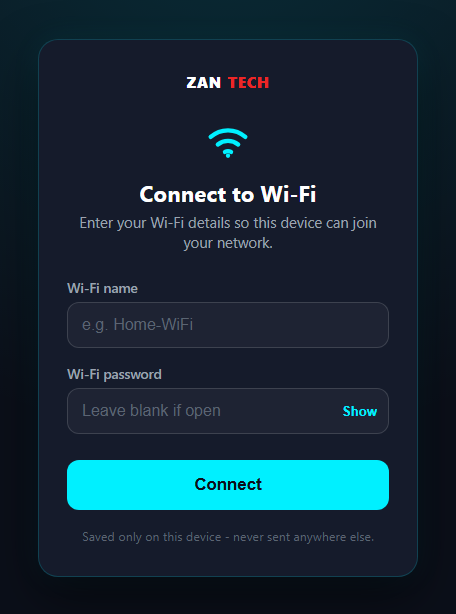
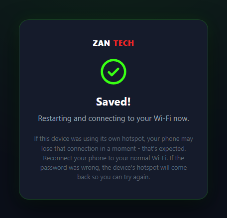
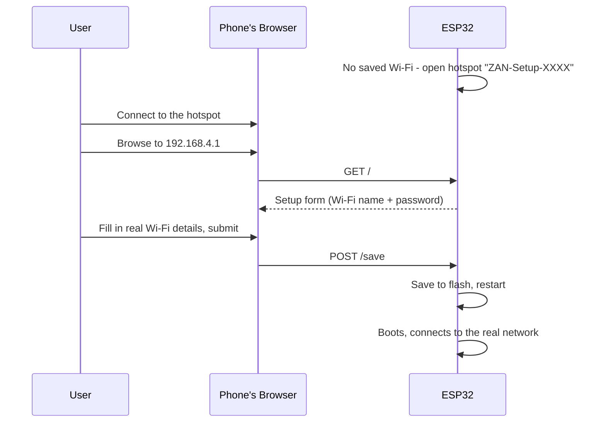

# ZanWifiSetup

**An Arduino library that gets any ESP32 onto Wi-Fi without ever touching
the code — flash it once, then build your actual project separately and
never deal with Wi-Fi setup again.**

Made by **[ZAN Tech](https://github.com/ZAN-Tech-bd)** and released as a
free, open-source baseline. Use it as-is, rip out the parts you don't need,
or build an entire product on top of it — that's the point.

[](LICENSE)
[](src/)

## What this is

A lot of ESP32 projects hardcode the Wi-Fi SSID/password in the source
file, which means every device needs to be reflashed to move it to a new
network — a dealbreaker if you're handing devices to people who can't (or
shouldn't have to) do that themselves. It also means every new project
starts by re-writing the same Wi-Fi setup code from scratch.

This repo is a **library**, not just a sketch, specifically to solve the
second problem too: install it once, and it's done — every future project
just includes it and gets Wi-Fi provisioning for free, without ever
touching or rewriting that part again.

1. A fresh (or reset) ESP32 boots with no saved Wi-Fi and opens its own
   hotspot, `ZAN-Setup-XXXX`.
2. Connect a phone to that hotspot and open a browser — no app needed.
3. A simple page asks for a Wi-Fi name and password.
4. Submitting it saves the credentials to flash and restarts the device,
   which connects straight to that network from then on.
5. The onboard LED shows status at a glance: **solid on = connected**,
   **blinking = waiting for setup**.
6. Moving the device somewhere new? Hold the reset button (BOOT / GPIO0)
   for 3 seconds to erase the saved Wi-Fi and reopen the hotspot.

## What it looks like

<p align="center">
  
  
</p>

Left: the form shown at `192.168.4.1` right after connecting to the
device's hotspot. Right: the confirmation shown after submitting, just
before the device restarts. Colors match ZAN Tech's actual brand — checked
against [zantechbd.com](https://zantechbd.com)'s live styles rather than
guessed: dark navy (`#0B0F19`), cyan `#00F0FF` as the primary accent, red
`#ED2626` for the "TECH" half of the logo. Editable in one place:
[`src/zan_wifi_setup_page.h`](src/zan_wifi_setup_page.h).



## Repo structure

```
esp-wifi-provisioning/
├── src/                          The library itself (ZanWifiSetup.h/.cpp + the setup page's HTML)
├── examples/
│   ├── WifiOnly/                  The smallest possible sketch - flash this once
│   ├── BlinkWhileConnected/       Shows where your own project code goes
│   └── CustomConfiguration/       Every configuration option in one sketch
├── docs/                         Documentation + screenshots (see below)
├── library.properties             Arduino library metadata
└── .github/                       CI: compiles all three examples on every push
```

## Documentation

| Doc | What's in it |
|---|---|
| [**GETTING_STARTED.md**](docs/GETTING_STARTED.md) | The full walkthrough: install the library, flash it, connect it, reconfigure it, build your own project on top |
| [**API_REFERENCE.md**](docs/API_REFERENCE.md) | Every method — what it does, when it blocks, every configuration option and its default, what's stored where |
| [**TROUBLESHOOTING.md**](docs/TROUBLESHOOTING.md) | Common problems and fixes, starting with the #1 one: ESP32 only supports 2.4GHz Wi-Fi |
| [`src/ZanWifiSetup.h`](src/ZanWifiSetup.h) | The same API reference, inline in the header if you're already in your editor |

## Quick start

1. **Install the library** — download/clone this repo, then in Arduino
   IDE: Sketch → Include Library → Add .ZIP Library... and select this
   folder (or a zipped copy of it). One-time setup, works for every future
   project.

2. **Flash `examples/WifiOnly` once.** In Arduino IDE: File → Examples →
   ZanWifiSetup → WifiOnly, pick your board/port, Upload. That's the
   entire sketch:

   ```cpp
   #include <ZanWifiSetup.h>

   void setup() { ZanWifiSetup.begin(); }
   void loop()  { ZanWifiSetup.loop(); }
   ```

3. **Power it on.** It opens a hotspot named `ZAN-Setup-XXXX`.

4. **Connect a phone to that hotspot**, browse to `http://192.168.4.1/`,
   enter your Wi-Fi name and password, submit. (Use your **2.4GHz**
   network — ESP32 can't see 5GHz Wi-Fi at all; see
   [TROUBLESHOOTING.md](docs/TROUBLESHOOTING.md) if that's not obvious
   from your Wi-Fi list.)

5. Done — it restarts, joins your Wi-Fi, and the LED goes solid.

6. **Building an actual project?** Start a new sketch, `#include
   <ZanWifiSetup.h>` there too, and write your own code around it — see
   `examples/BlinkWhileConnected`, or `examples/CustomConfiguration` if you
   also want to change the hotspot name, LED pin, reset pin, or timeout.
   The Wi-Fi part is done; you never touch it again.

Full details, including every configuration option and how to reconfigure
a device later, are in [`docs/GETTING_STARTED.md`](docs/GETTING_STARTED.md).

## Works with every ESP32 variant

This uses Wi-Fi only — no Bluetooth — so it runs on literally any ESP32
chip: original ESP32, S2, S3, C3, C6, C2. (An earlier version of this repo
used BLE + a companion phone app instead; that's gone now in favor of this
much simpler approach, which needs no app and works on Wi-Fi-only chips
like the S2 too.)

## Contributing

Issues and PRs welcome — see [`CONTRIBUTING.md`](CONTRIBUTING.md).

## License

[MIT](LICENSE) — do whatever you want with it, including using it in
closed-source commercial products. Attribution is appreciated but not
required.

---

Built and maintained by **ZAN Tech**.
