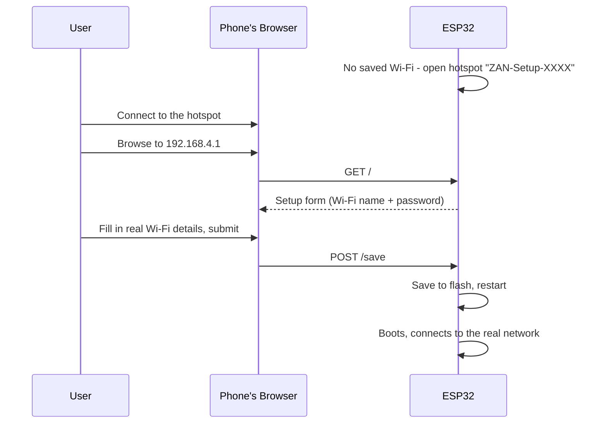

# esp-wifi-provisioning

**Connect any ESP32 to Wi-Fi without ever touching the code — no
hardcoded credentials, no serial cable, no app to install.**

Made by **[ZAN Tech](https://github.com/ZAN-Tech-bd)** and released as a
free, open-source baseline. Use it as-is, rip out the parts you don't need,
or build an entire product on top of it — that's the point.

[](LICENSE)
[](firmware/)

## What this is

A lot of ESP32 projects ship with the Wi-Fi SSID/password hardcoded in the
source file, which means every device needs to be reflashed to move it to
a new network — a dealbreaker if you're handing devices to people who
can't (or shouldn't have to) do that themselves. This repo solves it with
the classic "Wi-Fi setup portal" pattern used across countless ESP32
projects:

1. A fresh (or reset) ESP32 boots with no saved Wi-Fi and opens its own
   hotspot, `ZAN-Setup-XXXX`.
2. Connect a phone to that hotspot and open a browser — no app needed.
3. A simple page asks for a Wi-Fi name and password.
4. Submitting it saves the credentials to flash and restarts the device,
   which connects straight to that network from then on.



## Repo structure

```
esp-wifi-provisioning/
├── firmware/     The Arduino sketch (esp-wifi-provisioning.ino + page.h)
├── docs/         Step-by-step setup guide
└── .github/      CI: compiles the firmware on every push
```

- [`firmware/README.md`](firmware/README.md) — how it works, build/flash
  instructions, and the one deliberate trade-off it makes for simplicity.
- [`docs/GETTING_STARTED.md`](docs/GETTING_STARTED.md) — the full
  walkthrough from a blank board to a connected device.

## Quick start

1. **Flash it** onto any ESP32 board:

   ```bash
   # Arduino IDE: just open and upload - no extra libraries needed.
   firmware/esp-wifi-provisioning/esp-wifi-provisioning.ino

   # or arduino-cli:
   arduino-cli core install esp32:esp32
   cd firmware/esp-wifi-provisioning
   arduino-cli compile --fqbn esp32:esp32:esp32c3 .
   arduino-cli upload  --fqbn esp32:esp32:esp32c3 --port COM7 .
   ```

2. **Power it on.** It opens a hotspot named `ZAN-Setup-XXXX`.

3. **Connect a phone to that hotspot**, browse to `http://192.168.4.1/`,
   enter your Wi-Fi name and password, submit.

4. Done — it restarts and joins your Wi-Fi network.

Full details, including how to reconfigure a device later, are in
[`docs/GETTING_STARTED.md`](docs/GETTING_STARTED.md).

## Works with every ESP32 variant

This uses Wi-Fi only — no Bluetooth — so it runs on literally any ESP32
chip: original ESP32, S2, S3, C3, C6, C2. (An earlier version of this repo
used BLE + a companion phone app instead; that's gone now in favor of this
much simpler approach, which needs no app and works on Wi-Fi-only chips
like the S2 too.)

## Adding your own project

Everything lives in one sketch: `firmware/esp-wifi-provisioning/esp-wifi-provisioning.ino`
(logic) + `page.h` (the setup page's HTML). Two comments inside the `.ino`
mark exactly where your own project code goes — one for one-time setup,
one for your main loop. See [`firmware/README.md`](firmware/README.md) for
the full breakdown.

## Contributing

Issues and PRs welcome — see [`CONTRIBUTING.md`](CONTRIBUTING.md).

## License

[MIT](LICENSE) — do whatever you want with it, including using it in
closed-source commercial products. Attribution is appreciated but not
required.

---

Built and maintained by **ZAN Tech**.
