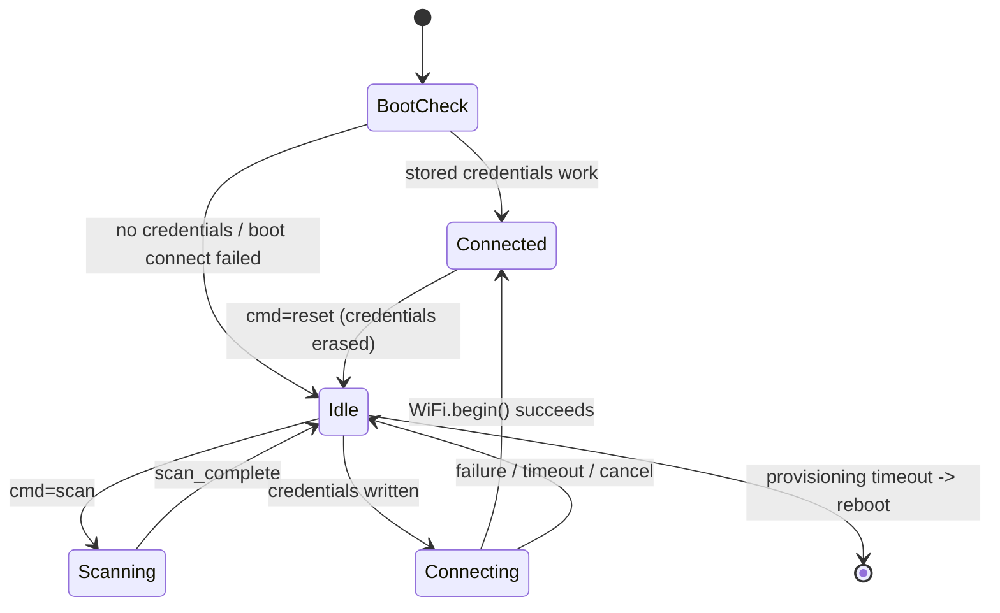
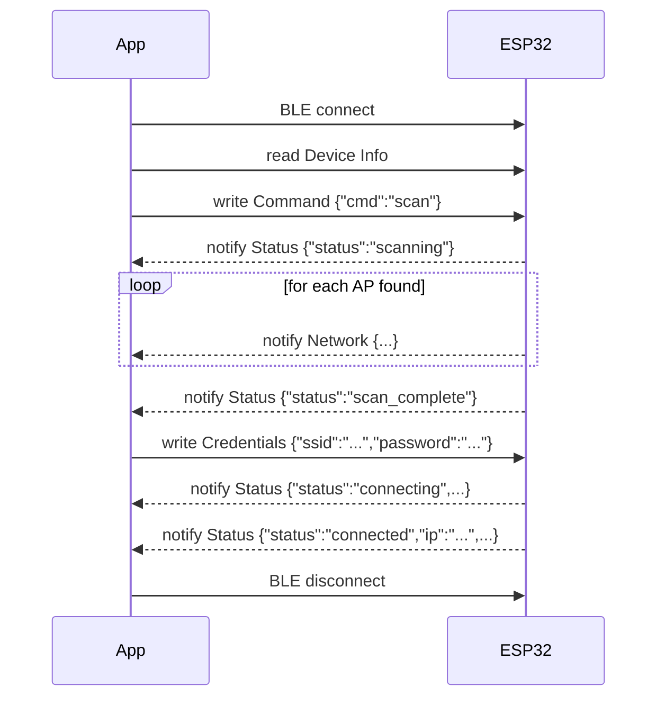

# ZAN Tech BLE Wi-Fi Provisioning Protocol (v1)

This document is the single source of truth for the BLE contract between the
ESP32 firmware and the mobile app. If you re-implement either side (a
different MCU, a native iOS/Android app, a web app using Web Bluetooth), stay
compatible with this spec and it will talk to the other side unmodified.

## 1. Advertising

| Field | Value |
|---|---|
| Device name | `ZAN-Prov-XXXX` where `XXXX` is the last 2 bytes of the MAC address, uppercase hex |
| Advertised service UUID | `b8a10000-2d4c-4a1e-9f3a-000000000000` |
| Mode | Connectable, scan-response enabled |

The app filters BLE scan results by the advertised service UUID (falls back
to a `ZAN-Prov-` name prefix match if the platform doesn't surface service
UUIDs during scanning).

## 2. GATT Service

**Service UUID:** `b8a10000-2d4c-4a1e-9f3a-000000000000`

| Characteristic | UUID | Properties | Direction | Purpose |
|---|---|---|---|---|
| Device Info | `b8a10001-2d4c-4a1e-9f3a-000000000000` | Read | ESP32 → App | Static device metadata |
| Command | `b8a10002-2d4c-4a1e-9f3a-000000000000` | Write | App → ESP32 | Trigger scan / reset / cancel |
| Network | `b8a10003-2d4c-4a1e-9f3a-000000000000` | Notify | ESP32 → App | One scanned Wi-Fi network per notification |
| Credentials | `b8a10004-2d4c-4a1e-9f3a-000000000000` | Write | App → ESP32 | SSID + password to try |
| Status | `b8a10005-2d4c-4a1e-9f3a-000000000000` | Read, Notify | ESP32 → App | Current provisioning state |

All payloads are UTF-8 JSON, no length prefix — a single BLE write/notify
carries one complete JSON object. Negotiate MTU ≥ 185 bytes from the app side
(`requestMtu(217)` on Android; iOS negotiates automatically) so a Wi-Fi
password up to 63 characters always fits in one write.

## 3. Message formats

### 3.1 Device Info (read)

```json
{ "device": "ZAN-Prov", "fw": "1.0.0", "mac": "AA:BB:CC:DD:EE:FF", "chip": "ESP32" }
```

### 3.2 Command (write, App → ESP32)

```json
{ "cmd": "scan" }
{ "cmd": "reset" }
{ "cmd": "cancel" }
```

- `scan` — start an async Wi-Fi scan. Results stream on the **Network**
  characteristic, terminated by a `scan_complete` status update.
- `reset` — erase stored credentials from flash (NVS) and reboot into
  provisioning mode. Used for "forget this network" in the app.
- `cancel` — abort an in-progress connection attempt and return to `idle`.

### 3.3 Network (notify, one per network, ESP32 → App)

```json
{ "type": "network", "index": 0, "total": 6, "ssid": "Home-WiFi", "rssi": -52, "secure": true }
```

Sent once per SSID found (duplicates from multiple APs collapsed to the
strongest RSSI). The app appends each one to its list as it arrives, then
sorts by RSSI once `status: scan_complete` is seen.

### 3.4 Credentials (write, App → ESP32)

```json
{ "ssid": "Home-WiFi", "password": "correct horse battery staple" }
```

Use `"password": ""` for an open network. On receipt, the firmware acks
immediately (moves Status to `connecting`) and attempts the connection
outside the BLE callback so the GATT stack never blocks.

### 3.5 Status (read current value, notify on change, ESP32 → App)

```json
{ "status": "idle" }
{ "status": "scanning" }
{ "status": "scan_complete" }
{ "status": "connecting", "ssid": "Home-WiFi" }
{ "status": "connected", "ssid": "Home-WiFi", "ip": "192.168.1.42", "rssi": -50 }
{ "status": "failed", "ssid": "Home-WiFi", "reason": "wrong_password" }
{ "status": "failed", "ssid": "Home-WiFi", "reason": "not_found" }
{ "status": "failed", "ssid": "Home-WiFi", "reason": "timeout" }
```

`reason` values: `wrong_password`, `not_found`, `timeout`, `unknown`.

## 4. State machine (firmware)



The reference firmware only brings up the BLE stack when provisioning is
actually needed (no stored credentials, or stored credentials just failed).
If a boot reconnects to Wi-Fi silently using stored credentials, BLE never
starts that session at all — saving RAM and keeping the radio quiet. To
re-enter provisioning after a silent successful boot, use the hardware reset
button (or any of your own triggers) to erase the stored credentials and
reboot; see `firmware/esp-ble-wifi-provisioning/config.h`. The `Connected`
state and the `reset` command above only apply while a BLE session from this
boot is still open (i.e. the device provisioned during this power cycle).

## 5. Sequence diagram (happy path)



## 6. Security notes

BLE writes on this service are **not encrypted by default** — this mirrors
most reference provisioning examples and keeps the baseline easy to pair
with any phone without a PIN dialog. Because provisioning only succeeds
within BLE range (a few meters) and only while the device is unprovisioned,
the realistic exposure window is small, but you should not treat this as
hardened for sensitive deployments.

If you need real confidentiality on the air:

1. Enable BLE Secure Connections + bonding — with NimBLE-Arduino (what this
   firmware uses), that's `NimBLEDevice::setSecurityAuth(true, true, true)`
   plus `NimBLEDevice::setSecurityIOCap(...)` for a passkey or numeric-
   comparison pairing flow (fixed or randomized passkey shown on a
   display/printed label).
2. Or layer app-level encryption on the `Credentials` payload (e.g. a
   pre-shared key baked into firmware + app at build time, AES-GCM the JSON
   body) — simpler to retrofit than BLE-level bonding and works even on
   phones that mishandle bonding dialogs.

Either change is isolated to `ble_provisioning.cpp` (firmware) and
`ble_provisioning_service.dart` (app) — the JSON schema above doesn't need to
change.

## 7. Versioning

This is protocol **v1**. If you make a breaking change (new required field,
different UUID, different framing), bump the `fw` version reported in Device
Info and gate app behavior on it, so old firmware and new firmware can both
be supported by one app release during a transition.
